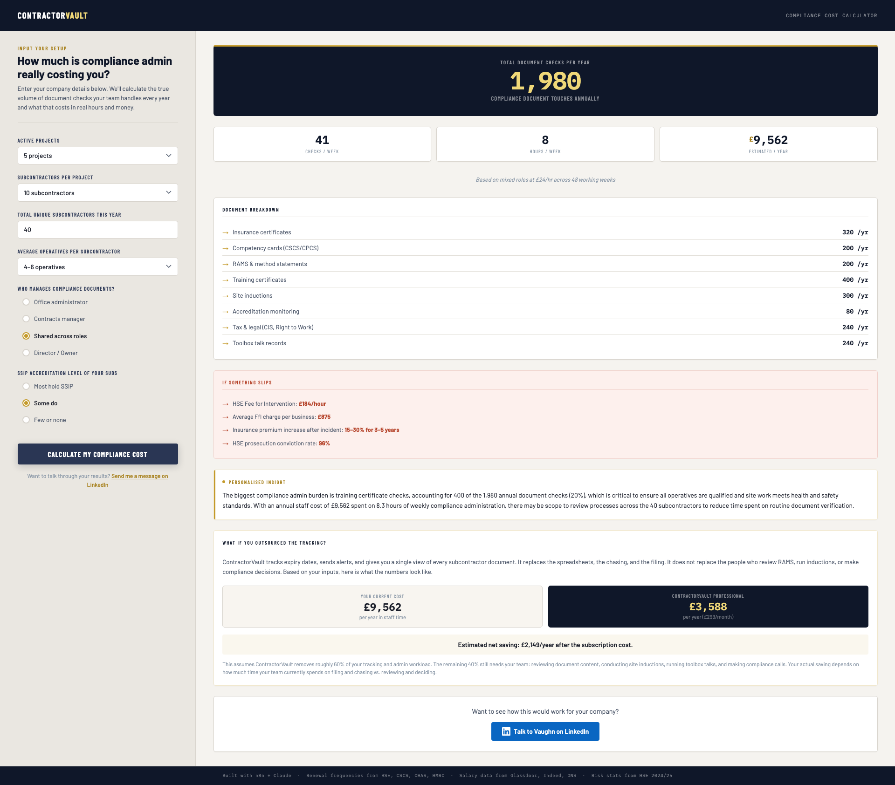
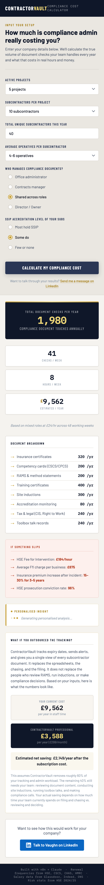
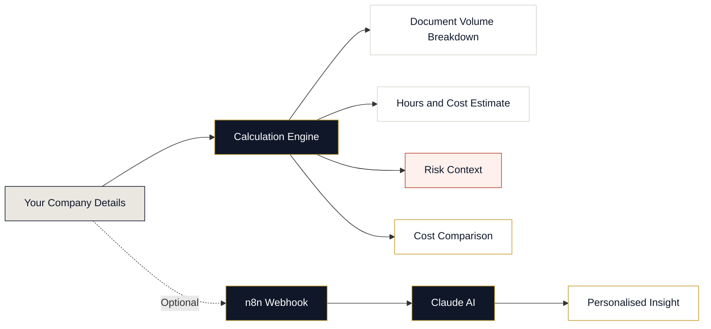

<div align="center">

# Compliance Cost Calculator

**Find out what subcontractor compliance admin is really costing your construction business.**

A free, open-source tool for UK contractors. No sign-up, no data collected, runs entirely in your browser.

[](https://vaughnbotha.github.io/compliance-cost-calculator/)
[](LICENSE)
[](#tech-stack)

</div>

---



<table>
<tr>
<td width="60%">

**Desktop view** with results panel showing document checks, cost breakdown, and risk context.

https://github.com/user-attachments/assets/hero-walkthrough.mp4

</td>
<td width="40%">

**Mobile view** with stacked layout.



</td>
</tr>
</table>

---

## Table of Contents

- [The Problem](#the-problem)
- [What This Calculator Does](#what-this-calculator-does)
- [How It Works](#how-it-works)
- [Example Scenarios](#example-scenarios)
- [Tech Stack](#tech-stack)
- [Data Sources and Methodology](#data-sources-and-methodology)
- [About ContractorVault](#about-contractorvault)
- [Quick Start](#quick-start)
- [Media Assets](#media-assets)
- [Licence](#licence)

---

## The Problem

If you run a UK construction company and manage subcontractors, you are sitting on a compliance admin problem that grows with every project you take on.

Every subcontractor brings documents. Insurance certificates, CSCS cards, RAMS, training records, accreditations, CIS verification, right to work checks. Every document has an expiry date. Every expiry needs someone to notice it, chase it, file it, and confirm it is current.

Most contractors manage this in spreadsheets, email folders, or shared drives. It works until it does not.

The numbers when it does not work:

| What happens | What it costs |
|:---|:---|
| HSE Fee for Intervention | **£184/hour** |
| Average FfI charge per business | **£875** |
| HSE prosecution conviction rate | **96%** |
| Insurance premium increase after a breach | **15-30% for 3-5 years** |
| Largest single construction fine in 2024 | **£2.34M** |

*Source: HSE Annual Report 2024/25*

This calculator shows you the scale of the admin work before anything goes wrong.

---

## What This Calculator Does

Enter your company details and get a full picture of your compliance workload:

**Compliance volume**
- Total document checks per year across your supply chain
- Weekly check volume and hours spent
- Annual cost in staff time (based on who in your team handles it)

**Full breakdown by document type**
- Insurance certificates (EL/PL)
- Competency cards (CSCS/CPCS)
- RAMS and method statements
- Training certificates (asbestos, first aid, working at height, manual handling)
- Site inductions
- Accreditation monitoring (CHAS, SafeContractor, Constructionline)
- Tax and legal (CIS verification, right to work)
- Toolbox talk records

**Risk context**
- What HSE enforcement actually costs if a document gap gets found
- Insurance premium impact
- Prosecution statistics

**Personalised AI insight**
- A tailored analysis generated for your specific setup, powered by an n8n webhook and Claude

**Cost comparison**
- Side-by-side comparison of your current admin cost vs outsourcing the tracking to ContractorVault

---

## How It Works

All calculations run in your browser. No data is sent anywhere except for the optional AI insight, which calls an n8n webhook to generate a personalised analysis.



### Calculation model

Each document type has a verified renewal frequency. The calculator multiplies your subcontractor count, operative count, and project count against these frequencies to produce a total annual check volume.

| Document type | What drives the count | Renewal basis |
|:---|:---|:---|
| Insurance (EL/PL) | 2 policies per sub, quarterly checks | Annual renewal, quarterly monitoring |
| CSCS/CPCS cards | Per operative | 5-year validity, annual expiry scan |
| RAMS | Per sub per project, ~4 per task | Per task/activity |
| Asbestos awareness | Per operative | 365-day validity (UKATA) |
| First aid / WAH | Per operative | 3-year validity (HSE guidance) |
| Manual handling | Per operative | 3-year validity |
| Site inductions | Per person per site | Per site engagement |
| Accreditations | Per accredited sub, quarterly checks | Annual renewal (CHAS/SSIP) |
| CIS verification | Per sub + per operative (RTW) | 2-year validity (HMRC) |
| Toolbox talks | Per project, weekly | 48 working weeks/year |

**Time per check:** 12 minutes per document touch, calibrated against the industry benchmark of 3-10 hours per week (builderexpert.uk).

**Hourly rates** (including ~30% employer costs):

| Role | Rate used |
|:---|:---|
| Office administrator | £16/hr |
| Shared across roles | £24/hr |
| Contracts manager | £35/hr |
| Director / Owner | £45/hr |

*Rates sourced from Glassdoor, Indeed, Jooble, PayScale, Randstad, and ONS employer cost data.*

---

## Example Scenarios

Real outputs from the calculator for three different company sizes.

### Small contractor
*2 projects, 12 subcontractors, 2-3 operatives each, director handles compliance, few hold SSIP*

| Metric | Value |
|:---|:---|
| Document checks per year | **417** |
| Checks per week | **9** |
| Hours per week | **1.7** |
| Annual cost (director at £45/hr) | **£3,672** |

At this scale, compliance admin is a manageable weekly task. The risk is not the time, it is that one person tracking everything in their head eventually misses something.

---

### Mid-size contractor
*5 projects, 40 subcontractors, 4-6 operatives each, contracts manager handles compliance, some hold SSIP*

| Metric | Value |
|:---|:---|
| Document checks per year | **1,980** |
| Checks per week | **41** |
| Hours per week | **8.3** |
| Annual cost (contracts manager at £35/hr) | **£13,944** |

This is a full day of admin every week. Your contracts manager is spending roughly 20% of their working hours on document chasing instead of managing contracts.

---

### Larger contractor
*8 projects, 80 subcontractors, 7-10 operatives each, shared across roles, most hold SSIP*

| Metric | Value |
|:---|:---|
| Document checks per year | **5,580** |
| Checks per week | **116** |
| Hours per week | **23.3** |
| Annual cost (mixed roles at £24/hr) | **£26,842** |

At this scale, compliance tracking is a half-time job spread across multiple people. The risk of something slipping through a crack is not theoretical, it is statistical.

---

## Tech Stack

This calculator was built in a single working session. No framework, no build step, no dependencies. One HTML file.

| Tool | What it did |
|:---|:---|
| **[Claude Code](https://claude.ai)** | Built everything: UI design, calculation logic, responsive layout, copy, and the n8n integration. From blank file to working calculator in one conversation. |
| **[n8n](https://n8n.io)** | Self-hosted workflow automation. Powers the personalised AI insight via a webhook that receives the user's inputs and returns a tailored analysis from Claude. |
| **[Perplexity API](https://www.perplexity.ai)** | Research during development. Verified every document renewal frequency, cross-checked salary data, confirmed HSE enforcement statistics against official sources. |
| **[Brave Search API](https://brave.com/search/api/)** | Cross-referenced UK-specific data during development. HSE fine amounts, salary ranges from multiple job boards, ONS employer cost calculations. |

### Why no framework?

The goal was a single file that loads fast, works anywhere, and has zero maintenance overhead. The entire calculator is inline HTML, CSS, and vanilla JavaScript. It works offline (except for the AI insight). There is nothing to install, nothing to build, and nothing to break.

This is also a demonstration of what is possible with modern AI development tools. The entire tool, from research to working product, was produced in one session with Claude Code acting as the developer and Perplexity and Brave handling the data verification.

---

## Data Sources and Methodology

Every number in the calculator is traceable to a source. The methodology is transparent so you can verify it yourself.

### Document renewal frequencies

| Source | What it covers |
|:---|:---|
| [HSE (Health and Safety Executive)](https://www.hse.gov.uk) | Training validity periods, first aid certificate renewal, working at height guidance |
| [CSCS (Construction Skills Certification Scheme)](https://www.cscs.uk.com) | Card validity periods (5 years standard) |
| [CHAS](https://www.chas.co.uk) | Accreditation renewal cycles |
| [HMRC](https://www.gov.uk/what-is-the-construction-industry-scheme) | CIS verification requirements and validity |
| [UKATA](https://www.ukata.org.uk) | Asbestos awareness certificate validity (365 days) |
| [Environment Agency](https://www.gov.uk/waste-carrier-or-broker-registration) | Waste carrier licence renewal periods |

### Salary and cost data

- Glassdoor, Indeed, Jooble, PayScale, and Randstad salary listings for UK construction roles
- ONS (Office for National Statistics) employer cost data
- All hourly rates include approximately 30% on top for employer costs (National Insurance, pension contributions, etc.)

### Risk and enforcement statistics

- [HSE Annual Report 2024/25](https://www.hse.gov.uk/statistics/) — fines, prosecution outcomes, conviction rates
- HSE Fee for Intervention: £184/hour, average charge £875 per business
- Insurance premium data: industry benchmark of 15-30% increase for 3-5 years following a compliance breach

### Time benchmarks

- Industry benchmark: 3-10 hours per week for compliance admin (builderexpert.uk)
- The calculator uses 12 minutes per document touch, calibrated to produce outputs that fall within this benchmark range for typical company sizes

### Assumptions and limitations

- Document frequencies are based on standard renewal cycles. Your actual volume may vary based on project complexity and client requirements.
- The calculator does not account for principal contractor duties under CDM 2015, which add further document requirements.
- Salary rates are UK averages. London and South East rates are typically 10-20% higher.
- The 60% admin reduction estimate in the cost comparison section reflects the portion of work that is tracking, filing, and chasing (which can be outsourced) vs reviewing, deciding, and conducting (which cannot).

---

## About ContractorVault

[ContractorVault](https://www.contractorvault.co.uk/) is a compliance document tracking service for UK construction companies.

We track your subcontractors' documents, record expiry dates, send alerts before anything lapses, and give you a clear view of what is current, what is expiring, and what is missing across your entire supply chain.

This is not software you need to learn. It is a service. We handle the tracking so your team can focus on the work that actually earns money.

**Currently enrolling Founding Members** (first 20 clients). Founding Members lock in launch pricing for life, get free onboarding and setup, and have direct input into the product roadmap.

Plans start at £149/month. [Book a free setup call](https://www.contractorvault.co.uk/) to see how it works for your company.

---

## Quick Start

No setup needed. Clone the repo and open the file.

```bash
git clone https://github.com/vaughnbotha/compliance-cost-calculator.git
cd compliance-cost-calculator
open index.html
```

Everything runs in your browser. The personalised AI insight feature requires the n8n webhook to be active. All other features work offline.

---

## Media Assets

All screenshots and videos are in the `docs/` folder:

| File | What it shows |
|:---|:---|
| `docs/screenshot-full.png` | Full page with both panels and results displayed |
| `docs/screenshot-results.png` | Results panel with hero stat, breakdown, and risk block |
| `docs/screenshot-mobile.png` | Mobile responsive layout (375px) with stacked panels |
| `docs/screenshot-insight.png` | AI personalised insight block |
| `docs/hero-walkthrough.mp4` | Full walkthrough: form fill, calculate, scroll through all results |
| `docs/quick-results.mp4` | Quick 10-second clip of the results animating in |

---

## Licence

MIT. Free to use, modify, and distribute.

Built by [Vaughn Botha](https://www.linkedin.com/in/vaughnbotha/).
